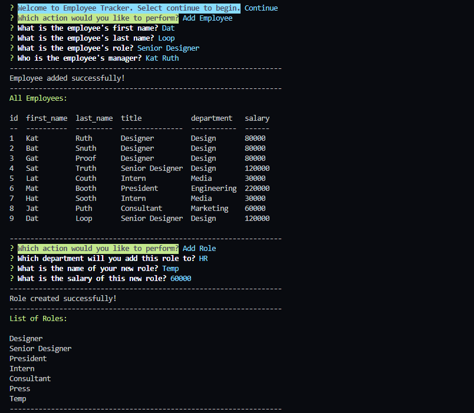

# Command Line Employee Tracker :clipboard:

### This command line application manages a company's employees using Node, Inquirer, and MySQL.

## *Table of Contents*

- [Description](#description)
- [Installation](#installation)
- [Usage](#usage)
- [Screenshots](#screenshots)
- [Questions](#questions)

## *Description*
Keep track of your team's relevant information like departments, roles and employees using this command line interface.

## *Installation*
### Navigate into the repository folder on your local machine and open the built-in terminal. You will need Node.js installed to run this application.
- In the root folder, open a terminal and type `npm i` to pull the project dependencies to your local. This app uses Express, MySQL and Inquirer along with some helper dependencies like Chalk and Nodemon.

## *Usage*
### :movie_camera: [This video](path) demonstrates the full functionality of this app.
- This application runs entirely in the command line. The prompts interact with the data stored in the connected Employees MySQL database.
- To begin viewing and editing Employee information, type `npm start` in the terminal to spin up the server.
- Then, use the arrow keys and `ENTER` to make your menu selections.

## *Screenshots*

## *Questions?*
- My Profile: [katsign](https://github.com/katsign)

---
This project is MIT licensed. &copy; 2021
